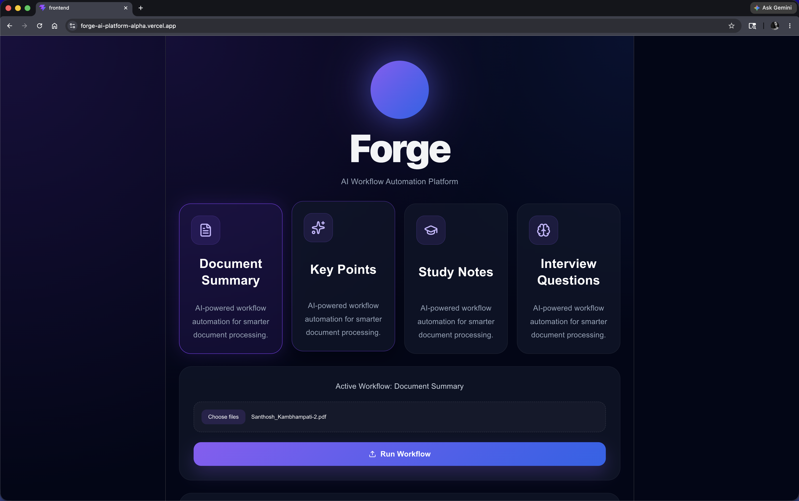
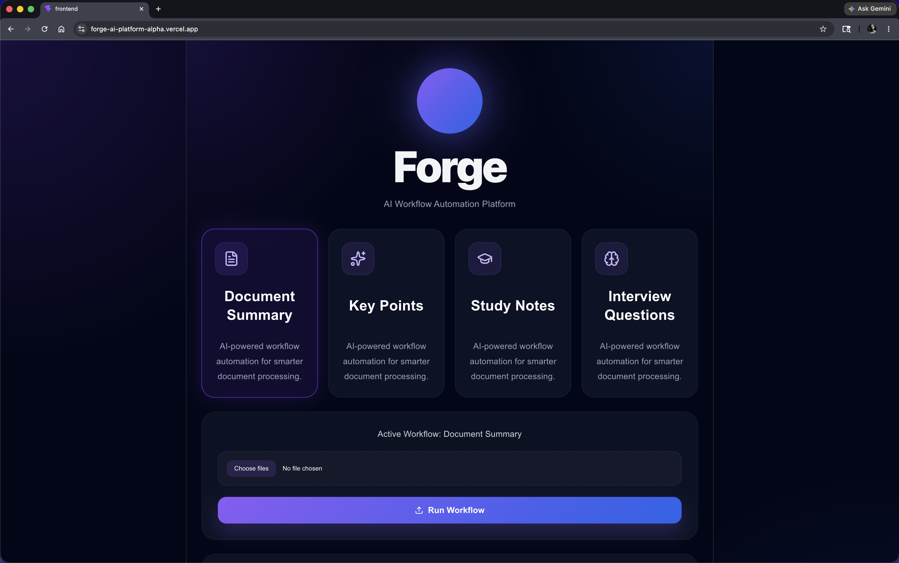
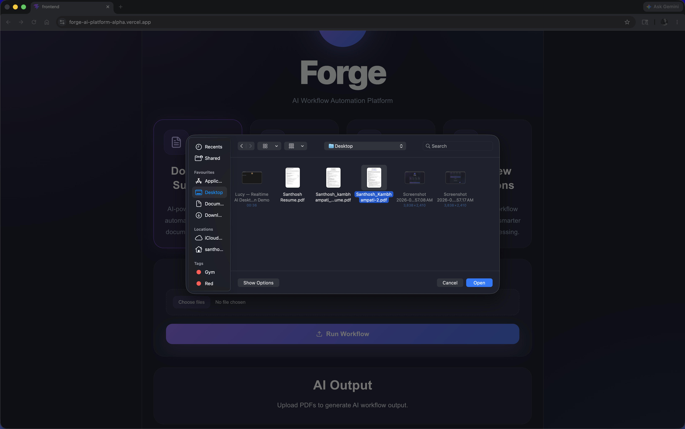
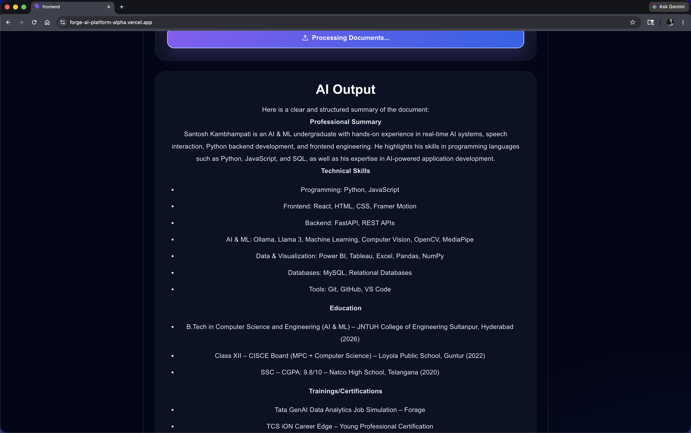

# Forge AI

AI-powered workflow automation platform for intelligent document processing using RAG, semantic retrieval, and streaming AI responses.

---

## Live Demo

Frontend:  
https://forge-ai-platform-alpha.vercel.app
this only works when my Local backend server is running!

Backend:  
Powered locally using Ollama + FastAPI + ngrok 

## Demo Video

Watch Forge AI in action:

[▶ Watch Demo Video](https://youtu.be/k42EzNmz6_8)

---

## Features

- AI-powered document workflows
- Multi-PDF upload support
- Document summarization
- Key point extraction
- Study notes generation
- Interview question generation
- RAG-powered document chat
- Semantic vector retrieval
- Streaming AI responses
- Modern AI SaaS UI
- Workflow history tracking
- Local LLM inference using Ollama

---

## Screenshots

### Workflow Dashboard

---

### Upload & AI Processing

---

### AI Document Chat

---